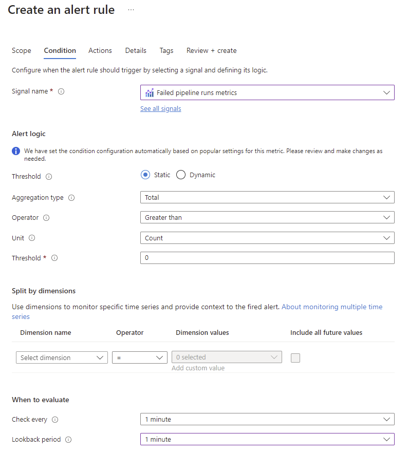

# Get better (and actionable) alerts from your Orchestration Pipelines

- [Get better (and actionable) alerts from your Orchestration Pipelines](#get-better-and-actionable-alerts-from-your-orchestration-pipelines)
  - [Introduction](#introduction)
  - [Replacing Azure Monitor Alerts with informational emails](#replacing-azure-monitor-alerts-with-informational-emails)
    - [The end result](#the-end-result)
    - [Prerequisites](#prerequisites)
      - [Sending mails through Microsoft Graph](#sending-mails-through-microsoft-graph)
      - [Infrastructure](#infrastructure)
      - [RBAC Permissions](#rbac-permissions)
      - [You need to deploy](#you-need-to-deploy)
    - [Implementation](#implementation)
      - [Templates](#templates)
      - [Configuration](#configuration)
        - [Azure Function Application Properties](#azure-function-application-properties)
        - [Azure Monitor Alert](#azure-monitor-alert)
  - [Replacing Azure Monitor Alerts with Actionable Messages](#replacing-azure-monitor-alerts-with-actionable-messages)
    - [The end result](#the-end-result-1)
    - [Prerequisites](#prerequisites-1)
      - [Register as an Actionable Message sender in your Organization](#register-as-an-actionable-message-sender-in-your-organization)
        - [Creating an Originator](#creating-an-originator)
        - [Get it approved by your Exchange Admin](#get-it-approved-by-your-exchange-admin)
      - [Sending mails through Microsoft Graph](#sending-mails-through-microsoft-graph-1)
      - [Infrastructure](#infrastructure-1)
      - [RBAC Permissions](#rbac-permissions-1)
      - [You need to deploy](#you-need-to-deploy-1)
    - [Implementation](#implementation-1)
      - [Templates](#templates-1)
      - [Configuration](#configuration-1)
        - [Azure Function Application Properties](#azure-function-application-properties-1)
        - [Azure Monitor Alert](#azure-monitor-alert-1)
  - [3rd party libraries](#3rd-party-libraries)


## Introduction
This project is here to help you move from the traditional *A pipeline has failed* emails send from Azure Monitor into something that's easier to work with and requires less detective work to begin remediating.

The current state of alerts: \


This solution can be implemented without doing **any changes** to your pipelines - it is 100% based on the telemetry gathered by Azure Monitor.

It can also be used to support several instances of orchestration pipelines. (you'll need to setup the RBAC roles for each).
This is made possible by the [common alert schema](https://learn.microsoft.com/en-us/azure/azure-monitor/alerts/alerts-common-schema) which includes info about which Azure Resource the alert is related to, allowing the code to dynamically connect to the correct instance:
``` json
{
    "schemaId": "azureMonitorCommonAlertSchema",
    "data": {
        "essentials": {
            "alertTargetIDs": [
                "/subscriptions/<subId>/resourcegroups/<rgNAme>/providers/microsoft.datafactory/factories/<adfName>"
            ]
        },
        "alertContext": {
            "condition": {
                "windowStartTime": "2024-10-07T07:52:20.859Z",
                "windowEndTime": "2024-10-07T07:53:20.859Z"
            }
        },
        "customProperties": null
    }
}
```
*Abbreviated for clarity*
## Replacing Azure Monitor Alerts with informational emails
### The end result
Let's first start by showing what you'll achieve by implementing this approach: \


### Prerequisites

#### Sending mails through Microsoft Graph
You will need to get an Azure Entra Id Application setup with **Application** permission to send emails from a single mailbox.  
See [this documentation article](https://learn.microsoft.com/en-us/graph/auth-limit-mailbox-access) for more info on how to achive this.

You will need the following information:
* Tenant Id
* Application Id
* Client Secret
* ObjectId of the account sending the email
* Email Address of the account sending the email

#### Infrastructure

*I have not yet found the time to include IaC templates to this project, but I do accept pull requets.*

In order to use this setup, you'll need:
* One (or more) instance(s) of Data Factory
* One Azure Function App running .NET 8 in Isolated Worker Mode with an assigned Managed Identity (system/user assigned)
* One Azure Monitor Alert - see [Azure Monitor Alert](#azure-monitor-alert)

#### RBAC Permissions

In order to be able to query the telemetry from Data Factory, the Function Apps Managed Identity needs to be granted the `Monitoring Reader` role on the Data Factory Instance.

#### You need to deploy 

The Azure Functions project available in the Src folder.

### Implementation

#### Templates
To set your own design on the email that is sent, you'll need to update the following templates:
* [ErrorMailBody.html](./Src/OrchestrationPipelinesAlert/Templates/Mail/ErrorMailBody.html)
* [ErrorMailSubject.txt](./Src/OrchestrationPipelinesAlert/Templates/Mail/ErrorMailSubject.txt)

Please pay attention to the [Handlebars syntax in the templates](https://handlebarsjs.com/).

#### Configuration

##### Azure Function Application Properties

The following properties has to be setup:
```json
{
    "Values": {
        "MicrosoftGraph_SendMailClientId": "Client Id from application setup under prerequisites",
        "MicrosoftGraph_SendMailTenantId":  "Tenant Id from application setup under prerequisites",
        "MicrosoftGraph_SendMailClientSecret": "Client Secret from application setup under prerequisites",
        "MicrosoftGraph_SendMailSenderObjectId": "Object Id of sender from application setup under prerequisites",
        "MicrosoftGraph_SendMailSenderEmail":  "Email Address of sender from application setup under prerequisites",
        "MicrosoftGraph_SendMailRecieverEmails": "Semi-colon separated list of receivers of the alerts"
    }
}
```

##### Azure Monitor Alert

You'll need to setup an Alert on your Data Factory Instance: \
 \
The alert should trigger on *Failed pipeline runs metric* and check every 1 minute with a lookback of 1 minute.

Skip the notifications step, where you would normally configure email notifications: \


Instead, add a new Action to invoke an Azure Function: \
 \

You can here just select the desired function (PipelineFailedSendMail).  Be sure to select to use the Common Alert Schema: \
 \


## Replacing Azure Monitor Alerts with Actionable Messages
### The end result
Let's first start by showing what you'll achieve by implementing this approach: \
 

The buttons can be configured to perform any action you can express in code. \
The only one that works out-of-the-box is the [Rerun failed pipeline] button, the others are there just as a showcase.

Whenever a recipient opens this message, the status of the alert and remediation is checked again, in case someone else has already responded to the alert.
### Prerequisites

#### Register as an Actionable Message sender in your Organization
##### Creating an Originator
Navigate to the [Actionable Email Developer Dashboard](https://aka.ms/publishoam) and click [New Provider]
 \

Fill in all the required info, be sure to select that you want to use the **Organization** scope: \
 \

Copy the **Provider Id (originator)** guid, you'll need it later.

##### Get it approved by your Exchange Admin
Do as it says on the page: \
**Note for Organization scoped AM registration** \
For faster approval, please ask your Exchange admins to approve your request here: https://outlook.office.com/connectors/oam/admin

(And probably bring cake, that typically helps...)

#### Sending mails through Microsoft Graph
See [Sending mails through Microsoft Graph](#sending-mails-through-microsoft-graph).

#### Infrastructure
See [Infrastructure](#infrastructure).

#### RBAC Permissions
In addition to the `Monitoring Reader` role mentioned [here](#rbac-permissions), you'll also need to grant the Azure Function Apps Managed Identity the `Data Factory Contributor` role to be able to rerun the failed pipelines.

#### You need to deploy 
See [You need to deploy](#you-need-to-deploy).

### Implementation

#### Templates
To set your own design on the email that is sent, you'll need to update the following templates:
* [ErrorMailBody.html](<./Src/OrchestrationPipelinesAlert/Templates/Adaptive Cards/ErrorMailBody.html>)
* [ErrorMailSubject.txt](<./Src/OrchestrationPipelinesAlert/Templates/Adaptive Cards/ErrorMailSubject.txt>)

And, if you are really brave, you can also update the template for the Adaptive Card/Actionable Message here: [PipelineFailedAdaptiveCard.json](<./Src/OrchestrationPipelinesAlert/Templates/Adaptive Cards/PipelineFailedAdaptiveCard.json>).  If you do decide to do so, please validate your changes in the [Actionable Message Designer](https://amdesigner.azurewebsites.net/)

#### Configuration

##### Azure Function Application Properties

In addition to the properties mentioned [here](#azure-function-application-properties), you also need to specify your originator id and the table name to store the state of each alert in (the table will be automatically created in the storage account connected to the Function App):
```json
{
    "Values": {
        "ActionableMessageOriginator": "Originator Id from application setup under prerequisites",
        "AzureStorageTables_TableName":  "A table name of your choise - my suggestion is PipelineFailedAlerts"
    }
}
```

##### Azure Monitor Alert
See [Azure Monitor Alert](#azure-monitor-alert), but instead of connection to the `PipelineFailedSendMail` function, you should use the `PipelineFailedSendActionableMessage` function.

## 3rd party libraries

To save time I used a couple of excellent resources available online, and I want to thank the creators for
allowing me to do so:

[Handlebars.Net](https://github.com/Handlebars-Net/Handlebars.Net) nuget is used for handling templates. \
This is used to generate the mail body and subjects. \
It is licensed under MIT license.

[o365-actionable-messages-utilities-for-dotnet](https://github.com/OfficeDev/o365-actionable-messages-utilities-for-dotnet/tree/master) code snippets are used for validating
actions taken by the end users in the actionable messages. \
It is licensed under MIT license.
